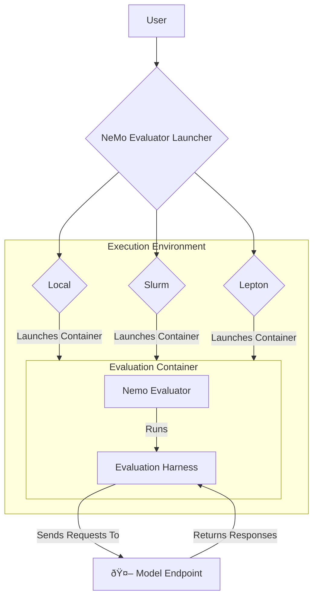

# NeMo Evaluator

[](https://github.com/NVIDIA-NeMo/Eval/blob/main/LICENSE)
[](https://www.python.org/downloads/)
[](https://github.com/NVIDIA-NeMo/Eval/actions/workflows/cicd-main.yml)
[](https://github.com/astral-sh/ruff)
[](https://pypi.org/project/nemo-evaluator/)
[](https://pypi.org/project/nemo-evaluator/)
[](https://pypi.org/project/nemo-evaluator-launcher/)
[](https://pypi.org/project/nemo-evaluator-launcher/)
[](#)

NeMo Evaluator is an open-source platform for robust, reproducible, and scalable evaluation of Large Language Models. It enables you to run hundreds of benchmarks across popular evaluation harnesses against any OpenAI-compatible model API. Evaluations execute in open-source Docker containers for auditable and trustworthy results. The platform's containerized architecture allows for the rapid integration of public benchmarks and private datasets.

[Tutorial](./docs/nemo-evaluator-launcher/tutorial.md) | [Supported Benchmarks](#supported-benchmarks-and-evaluation-harnesses) | [Configuration Examples](https://github.com/NVIDIA-NeMo/Eval/blob/main/packages/nemo-evaluator-launcher/examples) | [Contribution Guide](https://github.com/NVIDIA-NeMo/Eval/blob/main/CONTRIBUTING.md)

### Key Pillars
NeMo Evaluator is built on four core principles to provide a reliable and versatile evaluation experience.
- **Reproducibility by Default** -- All configurations, random seeds, and software provenance are captured automatically for auditable and repeatable evaluations.
- **Scale Anywhere** --  Run evaluations from a local machine to a Slurm cluster or cloud-native backends like Lepton AI without changing your workflow.
- **State-of-the-Art Benchmarking** --  Access a comprehensive suite of over 100 benchmarks from 18 popular open-source evaluation harnesses. See the full list of [Supported benchmarks and evaluation harnesses](#supported-benchmarks-and-evaluation-harnesses).
- **Extensible and Customizable** --  Integrate new evaluation harnesses, add custom benchmarks with proprietary data, and define custom result exporters for existing MLOps tooling.

### How It Works: Launcher and Core Engine

The platform consists of two main components:

- **`nemo-evaluator` ([The Evaluation Core Engine](./docs/nemo-evaluator/index.md))**: A Python library that manages the interaction between an evaluation harness and the model being tested.
- **`nemo-evaluator-launcher` ([The CLI and Orchestration](./docs/nemo-evaluator-launcher/index.md))**: The primary user interface and orchestration layer. It handles configuration, selects the execution environment, and launches the appropriate container to run the evaluation.

Most users only need to interact with the `nemo-evaluator-launcher` as universal gateway to different benchmarks and harnesses. It is however possible to interact directly with `nemo-evaluator` by following this [guide](./docs/nemo-evaluator/workflows/using-containers.md).




### 🚀 Quickstart

Get your first evaluation result in minutes. This guide uses your local machine to run a small benchmark against an OpenAI API-compatible endpoint.

#### 1. Install the Launcher
The launcher is the only package required to get started.

```bash
pip install nemo-evaluator-launcher
```

#### 2. Set Up Your Model Endpoint
NeMo Evaluator works with any model that exposes an OpenAI-compatible endpoint. For this quickstart, we will use the OpenAI API.

**What is an OpenAI-compatible endpoint?** A server that exposes /v1/chat/completions and /v1/completions endpoints, matching the OpenAI API specification.

**Options for model endpoints:**
- **Hosted endpoints** (fastest): Use ready-to-use hosted models from providers like build.nvidia.com that expose OpenAI-compatible APIs with no hosting required.
- **Self-hosted options**: Host your own models using tools like NVIDIA NIM, vLLM, or TensorRT-LLM for full control over your evaluation environment.

For detailed setup instructions including self-hosted configurations, see the [tutorial guide](./docs/nemo-evaluator-launcher/tutorial.md).

**Getting an NGC API Key for build.nvidia.com:**
To use out-of-the-box build.nvidia.com APIs, you need an API key:
1. Register an account at [build.nvidia.com](https://build.nvidia.com)
2. In the Setup menu under Keys/Secrets, generate an API key
3. Set the environment variable by executing `export NGC_API_KEY=<<YOUR_API_KEY>>`


#### 3. Run Your First Evaluation
Run a small evaluation on your local machine. The launcher automatically pulls the correct container and executes the benchmark. The list of benchmarks is directly configured in the yaml file.

**Configuration Examples**: Explore ready-to-use configuration files in [`packages/nemo-evaluator-launcher/examples/`](./packages/nemo-evaluator-launcher/examples/) for local, Lepton, and Slurm deployments with various model hosting options (vLLM, NIM, hosted endpoints).

Once you have the example configuration file (either by cloning this repository or downloading e.g. the `local_nvidia_nemotron_nano_9b_v2.yaml` file directly), you can run the following command:

```bash
nemo-evaluator-launcher run --config-dir packages/nemo-evaluator-launcher/examples --config-name local_nvidia_nemotron_nano_9b_v2 --override execution.output_dir=<YOUR_OUTPUT_LOCAL_DIR>
```

Upon running this command, you will be able to see a job_id, which can then be used for tracking the job and the reults with all the logs will be available in your `<YOUR_OUTPUT_LOCAL_DIR>`.

#### 4. Check Your Results
Results, logs, and run configurations are saved locally. Inspect the status of the evaluation job by using the corresponding job id:

```bash
nemo-evaluator-launcher status <job_id_or_invocation_id>
```

#### Next Steps

- List all supported benchmarks:
```bash
nemo-evaluator-launcher ls tasks
```
- Explore the [Supported Benchmarks](#supported-benchmarks-and-evaluation-harnesses) to see all available harnesses and benchmarks.
- Scale up your evaluations using the [Slurm Executor](./docs/nemo-evaluator-launcher/executors/slurm.md) or [Lepton Executor](./docs/nemo-evaluator-launcher/executors/lepton.md).
- Learn to evaluate self-hosted models in the extended [Tutorial guide](./docs/nemo-evaluator-launcher/tutorial.md) for nemo-evaluator-launcher.
- Customize your workflow with [Custom Exporters](./docs/nemo-evaluator-launcher/exporters/overview.md) or by evaluating with [proprietary data](./docs/nemo-evaluator/extending/framework-definition-file.md).


### Supported Benchmarks and Evaluation Harnesses

NeMo Evaluator Launcher provides pre-built evaluation containers for different evaluation harnesses through the NVIDIA NGC catalog. Each harness supports a variety of benchmarks, which can then be called via `nemo-evaluator`. This table provides a list of benchmark names per harness. A more detailed list of task names can be found in the [list of NGC containers](./docs/nemo-evaluator/index.md#ngc-containers).

| Container | Description | NGC Catalog | Latest Tag | Supported benchmarks |
|-----------|-------------|-------------|------------| ------------|
| **agentic_eval** | Agentic AI evaluation framework | [Link](https://catalog.ngc.nvidia.com/orgs/nvidia/teams/eval-factory/containers/agentic_eval) | `25.08.1` | Agentic Eval Topic Adherence, Agentic Eval Tool Call, Agentic Eval Goal and Answer Accuracy |
| **bfcl** | Function calling | [Link](https://catalog.ngc.nvidia.com/orgs/nvidia/teams/eval-factory/containers/bfcl) | `25.08.1` | BFCL v2 and v3 |
| **bigcode-evaluation-harness** | Code generation evaluation | [Link](https://catalog.ngc.nvidia.com/orgs/nvidia/teams/eval-factory/containers/bigcode-evaluation-harness) | `25.08.1` | MBPP, MBPP-Plus, HumanEval, HumanEval+, Multiple (cpp, cs, d, go, java, jl, js, lua, php, pl, py, r, rb, rkt, rs, scala, sh, swift, ts) |
| **garak** | Safety and vulnerability testing | [Link](https://catalog.ngc.nvidia.com/orgs/nvidia/teams/eval-factory/containers/garak) | `25.08.1` | Garak |
| **helm** | Holistic evaluation framework | [Link](https://catalog.ngc.nvidia.com/orgs/nvidia/teams/eval-factory/containers/helm) | `25.08.1` | MedHelm |
| **hle** | Academic knowledge and problem solving | [Link](https://catalog.ngc.nvidia.com/orgs/nvidia/teams/eval-factory/containers/hle) | `25.08.1` | HLE |
| **ifbench** | Instruction following | [Link](https://catalog.ngc.nvidia.com/orgs/nvidia/teams/eval-factory/containers/ifbench) | `25.08.1` | IFBench |
| **livecodebench** | Coding | [Link](https://catalog.ngc.nvidia.com/orgs/nvidia/teams/eval-factory/containers/livecodebench) | `25.08.1` | LiveCodeBench (v1-v6, 0724_0125, 0824_0225) |
| **lm-evaluation-harness** | Language model benchmarks | [Link](https://catalog.ngc.nvidia.com/orgs/nvidia/teams/eval-factory/containers/lm-evaluation-harness) | `25.08.1` | ARC Challenge (also multilingual), GSM8K, HumanEval, HumanEval+, MBPP, MINERVA MMMLU-Pro, RACE, TruthfulQA, AGIEval, BBH, BBQ, CSQA, Frames, Global MMMLU, GPQA-D, HellaSwag (also multilingual), IFEval, MGSM, MMMLU, MMMLU-Pro, MMMLU-ProX (de, es, fr, it, ja), MMLU-Redux, MUSR, OpenbookQA, Piqa, Social IQa, TruthfulQA, WikiLingua, WinoGrande|
| **mmath** | Multilingual math reasoning | [Link](https://catalog.ngc.nvidia.com/orgs/nvidia/teams/eval-factory/containers/mmath) | `25.08.1` | EN, ZH, AR, ES, FR, JA, KO, PT, TH, VI |
| **mtbench** | Multi-turn conversation evaluation | [Link](https://catalog.ngc.nvidia.com/orgs/nvidia/teams/eval-factory/containers/mtbench) | `25.08.1` | MT-Bench |
| **rag_retriever_eval** | RAG system evaluation | [Link](https://catalog.ngc.nvidia.com/orgs/nvidia/teams/eval-factory/containers/rag_retriever_eval) | `25.08.1` | RAG, Retriever |
| **safety-harness** | Safety and bias evaluation | [Link](https://catalog.ngc.nvidia.com/orgs/nvidia/teams/eval-factory/containers/safety-harness) | `25.08.1` | Aegis v2, BBQ, WildGuard |
| **scicode** | Coding for scientific research | [Link](https://catalog.ngc.nvidia.com/orgs/nvidia/teams/eval-factory/containers/scicode) | `25.08.1` | SciCode |
| **simple-evals** | Common evaluation tasks | [Link](https://catalog.ngc.nvidia.com/orgs/nvidia/teams/eval-factory/containers/simple-evals) | `25.08.1` | GPQA-D, MATH-500, AIME 24 & 25, HumanEval, MGSM, MMMLU, MMMLU-Pro, MMMLU-lite (AR, BN, DE, EN, ES, FR, HI, ID, IT, JA, KO, MY, PT, SW, YO, ZH), SimpleQA |
| **tooltalk** | Tool usage evaluation | [Link](https://catalog.ngc.nvidia.com/orgs/nvidia/teams/eval-factory/containers/tooltalk) | `25.08.1` | ToolTalk |
| **vlmevalkit** | Vision-language model evaluation | [Link](https://catalog.ngc.nvidia.com/orgs/nvidia/teams/eval-factory/containers/vlmevalkit) | `25.08.1` | AI2D, ChartQA, OCRBench, SlideVQA |


### Contribution Guide
We welcome community contributions. Please see our [Contribution Guide](https://github.com/NVIDIA-NeMo/Eval/blob/main/CONTRIBUTING.md) for instructions on submitting pull requests, reporting issues, and suggesting features.

