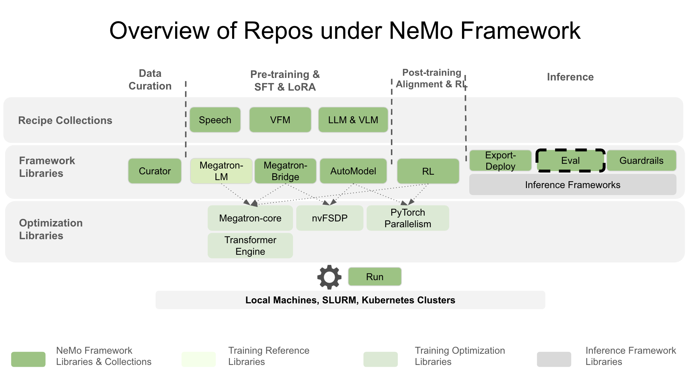

# About NeMo Evaluator

NeMo Evaluator is NVIDIA's comprehensive platform for AI model evaluation and benchmarking. It consists of two core libraries that work together to enable consistent, scalable, and reproducible evaluation of GenAI models spanning LLMs, VLMs, agentic AI, and retrieval systems.



## System Architecture

NeMo Evaluator consists of two main libraries:

### **nemo-evaluator** (Core Evaluation Engine)
The core, open-source evaluation engine that provides:
- Adapter/interceptor architecture for request and response processing
- Standardized evaluation workflows and containerized frameworks
- Deterministic configuration and reproducible results
- Consistent result schemas and artifact layouts

### **nemo-evaluator-launcher** (Orchestration Layer)
The user-facing orchestration layer that provides:
- Unified CLI and programmatic entry points
- Multi-backend execution (local, Slurm, cloud)
- Job monitoring and lifecycle management
- Result export to multiple destinations (MLflow, W&B, Google Sheets)

## Key Capabilities

### **Container-First Approach**
- **100+ Benchmarks**: Access to comprehensive benchmark suite across 18 open-source harnesses
- **NGC Containers**: Pre-built, reproducible evaluation containers through NVIDIA NGC catalog
- **Transparent Evaluation**: Fully open-source Docker containers guarantee reproducible results
- **Consistent Environments**: Containerized execution ensures results can be compared across runs

### **Multi-Backend Execution**
- **Local Execution**: Run evaluations on your workstation with Docker
- **HPC Clusters**: Submit jobs to Slurm-managed clusters for large-scale evaluation
- **Cloud Platforms**: Deploy and evaluate on Lepton AI and other cloud backends
- **Custom Backends**: Extensible architecture for any execution environment

### **Enterprise Features**
- **OpenAI-Compatible APIs**: Model separation via standardized API interfaces
- **Comprehensive Logging**: Request/response logging, caching, and debugging capabilities
- **Result Export**: First-class integration with MLflow, Weights & Biases, and more
- **Configuration Management**: Hydra-based configuration with reproducible run tracking

## Target Users

### 🎓 **Researchers**

Access 100+ benchmarks across 18 evaluation harnesses with containerized reproducibility. Run evaluations locally or on HPC clusters with minimal setup overhead.

### 👩‍💻 **ML Engineers**

Integrate evaluations into ML pipelines with programmatic APIs. Deploy models and run evaluations across multiple backends with consistent, reproducible results.

### 🏢 **Organizations**

Scale evaluation across teams with unified CLI, multi-backend execution, and enterprise-grade result tracking. Export results to existing MLOps infrastructure.

### 🧪 **AI Safety Teams**

Conduct comprehensive safety assessments using specialized containers for security testing, bias evaluation, and alignment verification with detailed logging and audit trails.

### 🔬 **Model Developers**

Evaluate custom models against standard benchmarks using OpenAI-compatible APIs. Extend the platform with custom frameworks and evaluation tasks.

## Project Governance

**Maintainer**: NVIDIA Corporation  
**License**: Apache License 2.0  
**Contact**: [nemo-toolkit@nvidia.com](mailto:nemo-toolkit@nvidia.com)  
**Repository**: [GitHub - NVIDIA-NeMo/Eval](https://github.com/NVIDIA-NeMo/Eval)

## Community & Support

- **Documentation**: [docs.nvidia.com/nemo/eval](https://docs.nvidia.com/nemo/eval/latest/index.html)
- **Issues**: [GitHub Issues](https://github.com/NVIDIA-NeMo/Eval/issues)
- **Discussions**: [GitHub Discussions](https://github.com/NVIDIA-NeMo/Eval/discussions)
- **Contributing**: See our [Contributing Guide](https://github.com/NVIDIA-NeMo/Eval/blob/main/CONTRIBUTING.md)

## Quick Start Options

Choose your path based on your needs:

### **🚀 NeMo Evaluator Launcher** (Recommended)
For most users who want a unified CLI and orchestration:
```bash
nemo-evaluator-launcher run --config-dir examples --config-name local_llama_3_1_8b_instruct
```

### **⚙️ NeMo Evaluator Core** (Advanced)
For developers who need programmatic access:
```python
from nemo_evaluator.core.evaluate import evaluate
result = evaluate(eval_cfg=config, target_cfg=target)
```

### **🐳 Container Direct** (Specialized)
For custom container workflows:
```bash
docker run --rm -it nvcr.io/nvidia/eval-factory/simple-evals:25.07.3
```

---

*NeMo Evaluator is part of the broader [NeMo Framework](https://github.com/NVIDIA-NeMo/) ecosystem, enabling end-to-end LLM development from training to deployment and evaluation.*
