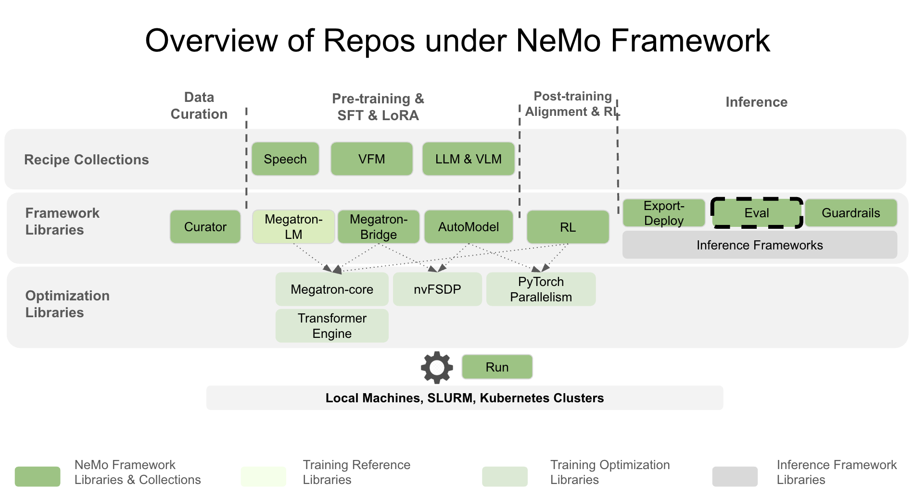

(about-overview)=

# About NeMo Evaluator

NeMo Evaluator is NVIDIA's comprehensive platform for AI model evaluation and benchmarking. It consists of two core libraries that work together to enable consistent, scalable, and reproducible evaluation of large language models across diverse capabilities including reasoning, code generation, function calling, and safety.



## System Architecture

NeMo Evaluator consists of two main libraries:

```{list-table} NeMo Evaluator Components
:header-rows: 1
:widths: 30 70

* - Component
  - Key Capabilities
* - **nemo-evaluator**  
    (*Core Evaluation Engine*)
  - • {ref}`interceptors-concepts` for request and response processing  
    • Standardized evaluation workflows and containerized frameworks  
    • Deterministic configuration and reproducible results  
    • Consistent result schemas and artifact layouts
* - **nemo-evaluator-launcher**  
    (*Orchestration Layer*)
  - • Unified CLI and programmatic entry points  
    • Multi-backend execution (local, Slurm, cloud)  
    • Job monitoring and lifecycle management  
    • Result export to multiple destinations (MLflow, W&B, Google Sheets)
```

## Target Users

```{list-table} Target User Personas
:header-rows: 1
:widths: 30 70

* - User Type
  - Key Benefits
* - **Researchers**
  - Access 100+ benchmarks across multiple evaluation harnesses with containerized reproducibility. Run evaluations locally or on HPC clusters.
* - **ML Engineers**
  - Integrate evaluations into ML pipelines with programmatic APIs. Deploy models and run evaluations across multiple backends.
* - **Organizations**
  - Scale evaluation across teams with unified CLI, multi-backend execution, and result tracking. Export results to MLflow, Weights & Biases, or Google Sheets.
* - **AI Safety Teams**
  - Conduct safety assessments using specialized containers for security testing and bias evaluation with detailed logging.
* - **Model Developers**
  - Evaluate custom models against standard benchmarks using OpenAI-compatible APIs.
```
