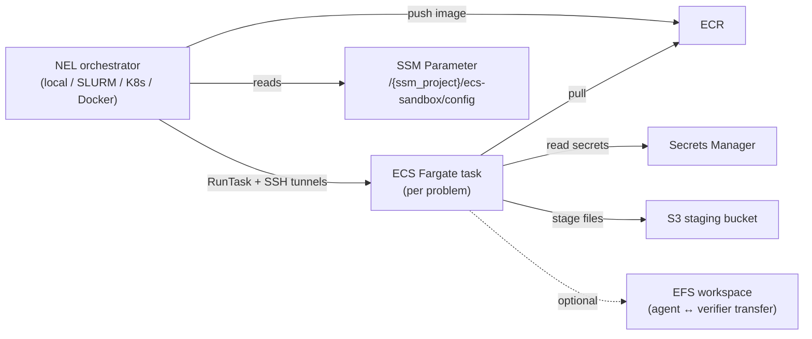

NEL's `ECSFargateSandbox` backend (see [Sandbox Orchestration](/architecture/sandbox#ecsfargatesandbox)) runs each per-problem agent or code execution as an ECS Fargate task in your AWS account. The eval loop itself stays on whatever orchestrator host you choose (laptop, SLURM login node, Docker, K8s pod) — only the per-problem sandbox executes in ECS.

This page documents the **reference Terraform** that provisions the AWS-side infrastructure the `ecs_fargate` sandbox configuration expects. It is **not** a deployment guide for NEL itself.

The full implementation lives in [`terraform/`](https://github.com/NVIDIA-NeMo/Evaluator/tree/main/terraform); see [`terraform/README.md`](https://github.com/NVIDIA-NeMo/Evaluator/blob/main/terraform/README.md) for the operator-facing walkthrough.

## Where this fits



When the YAML sets `region` and leaves `cluster` unset, the backend reads `/{ssm_project}/ecs-sandbox/config` from SSM and populates cluster, subnets, security groups, role ARNs, S3 bucket, ECR repository, EFS, and SSH-sidecar secret ARNs — anything you set in YAML still wins.

## What the Terraform creates

Per-region (one module instance per region in `var.regions`):

- **VPC** with public subnets across N AZs, internet gateway, route tables.
- **ECS Fargate cluster** with `containerInsights` and `execute-command` enabled.
- **Base task definition** (per-task tasks clone & override this).
- **ECR repository** with a 500-image lifecycle policy.
- **S3 staging bucket** with public access block and 7-day expiry.
- **CloudWatch log group** (30-day retention).
- **Secrets Manager** entries for the SSH-sidecar keypair and Docker Hub credentials.
- **SSM parameter** `/{project}/ecs-sandbox/config` with the JSON the sandbox backend reads.
- **Optional EFS workspace filesystem** for agent ↔ verifier file transfer.

Global (shared across all regions):

- **IAM roles**: ECS execution role, ECS task role, CodeBuild service role.
- **IAM user + access key + custom policy** for the orchestrator identity that submits `RunTask` and `StartBuild` calls.

## Prerequisites

- Terraform &gt;= 1.5
- AWS credentials with permissions for VPC, ECS, ECR, S3, EFS, IAM, Secrets Manager, SSM, and CloudWatch Logs in every target region

## Quick start

```bash
cd terraform/stacks/ecs-sandbox
cp terraform.tfvars.example terraform.tfvars
# edit terraform.tfvars: set project, regions, tags
terraform init
terraform plan -out tfplan
terraform apply tfplan
```

A single-region apply takes 3–5 minutes (mostly EFS mount-target propagation when `enable_efs = true`).

## Wiring NEL to the provisioned cluster

Once apply completes:

1. Read the orchestrator credentials and feed them to your environment:

   ```bash
   terraform output orchestrator_access_key_id
   terraform output -raw orchestrator_secret_access_key
   ```

2. Reference the cluster in your benchmark config:

   ```yaml
   benchmarks:
     - name: harbor://swebench-verified@1.0
       solver:
         type: harbor
       sandbox:
         type: ecs_fargate
         region: us-west-2
         # ssm_project must match the Terraform `var.project` so NEL can
         # find /{ssm_project}/ecs-sandbox/config in SSM. Default is "harbor";
         # the example tfvars use "nel-sandbox", so set it here too.
         ssm_project: nel-sandbox
         # All other fields (cluster, subnets, sgs, ecr, ssh keys, EFS, …)
         # come from SSM auto-discovery because `cluster` is omitted.
   ```

   See `EcsFargateSandbox` in [`src/nemo_evaluator/config/sandboxes.py`](https://github.com/NVIDIA-NeMo/Evaluator/blob/main/src/nemo_evaluator/config/sandboxes.py) for the complete schema.

## How task images reach ECR

Each task needs its image in ECR before Fargate can run it. There are two routes,
selected by `image_mirror_mode`:

```yaml
sandbox:
  type: ecs_fargate
  region: us-west-2
  image_mirror_mode: codebuild   # default: off
```

- **`off`** (default) — build the task's `environment/Dockerfile` via CodeBuild and push
  the result. The ECR tag is a content hash of the build context.
- **`codebuild`** — when the benchmark declares an already-published image (Harbor reads
  `task.toml [environment] docker_image`), copy that image into ECR instead of rebuilding
  it. The ECR tag is derived from the upstream manifest digest.

Prefer mirroring where it applies. A task Dockerfile typically installs from apt, pip or
`curl` without pinning, so rebuilding it resolves those references against whatever
upstream looks like at build time — two builds of the same commit are not guaranteed to
produce the same image. Because the repository carries a **500-image lifecycle policy
shared across every benchmark**, a high-volume benchmark can evict another's cached
images and silently trigger such a rebuild.

Copying is idempotent: the digest-derived tag means an evicted image is restored
byte-identical, so a cache miss costs latency rather than changing what the task runs.

Benchmarks that construct images programmatically (SWE-bench and friends) have no
upstream ref and always take the build path, regardless of this setting.

## State backend

Local state by default. To switch to a remote S3 backend, copy
[`terraform/stacks/ecs-sandbox/backend.tf.example`](https://github.com/NVIDIA-NeMo/Evaluator/blob/main/terraform/stacks/ecs-sandbox/backend.tf.example)
to `backend.tf`, supply your bucket and lock table, and run `terraform init -reconfigure`.

## Security

- The ECS-task security group's only ingress is `ssh_tunnel_sshd_port` restricted to `var.orchestrator_allowed_cidrs`. The Terraform variable is required and rejects `0.0.0.0/0`; set it to the orchestrator host's public egress CIDR(s).
- The orchestrator-side LLM endpoint is not exposed on the public internet: the sandbox reaches it via the SSH session's reverse tunnel (`-R`), which terminates on `127.0.0.1` on the orchestrator host.
- The orchestrator's IAM access key lives in Terraform state. Either keep state local and treated as a secret, or use an encrypted remote backend with strict access control.
- The Terraform tree is scanned by SonarQube's bundled IaC analyzer on every MR.

## Tear down

```bash
terraform destroy
```

ECR, S3, and Secrets Manager are configured to clean up immediately.
