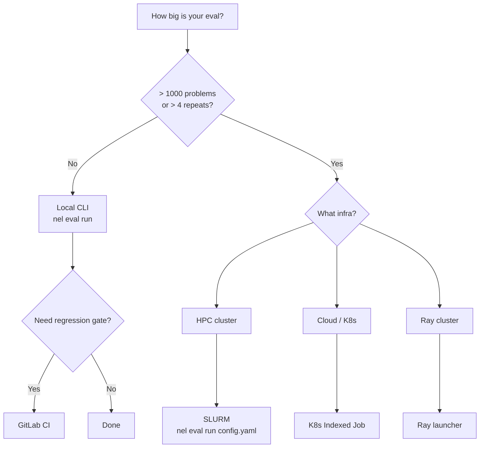

## Deployment Matrix

| Environment | Sharding | Live Serve | Regression Gate | Effort |
|-------------|----------|------------|-----------------|--------|
| [Local Deployment](/deployment/local) | Manual via env vars | `nel serve` | `nel compare` | Minimal |
| [Docker Compose](/deployment/docker) | Per-container env vars | docker-compose service | Script | Low |
| [SLURM](/deployment/slurm) | `nel eval run` with executor config | `nel serve` | sbatch chain | Medium |
| [Kubernetes Deployment](/deployment/kubernetes) | Indexed Job | Deployment + Service | CI pipeline | Medium |
| [Ray Deployment](/deployment/ray) | `@ray.remote` tasks | N/A | Script | Medium |
| [GitLab CI](/deployment/ci-regression) | CI variables per job | N/A | `regression:check` stage | Low |

## Which deployment to choose?

