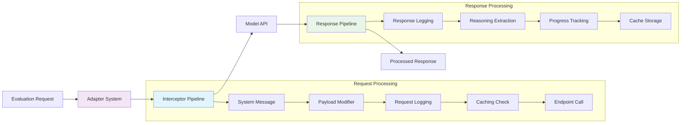

Interceptors provide fine-grained control over request and response processing during model evaluation through a configurable pipeline architecture.

## Overview

The adapter system processes model API calls through a configurable pipeline of interceptors. Each interceptor can inspect, modify, or augment requests and responses as they flow through the evaluation process.

## Request Interceptors

<Cards>

<Card title="System Messages" href="/libraries/nemo-evaluator/interceptors/system-messages">

Modify system messages in requests.
</Card>

<Card title="Payload Modification" href="/libraries/nemo-evaluator/interceptors/payload-modification">

Add, remove, or modify request parameters.
</Card>

<Card title="Request Logging" href="/libraries/nemo-evaluator/interceptors/request-logging">

Logs requests for debugging, analysis, and audit purposes.
</Card>

</Cards>

## Request-Response Interceptors

<Cards>

<Card title="Caching" href="/libraries/nemo-evaluator/interceptors/caching">

Cache requests and responses to improve performance and reduce API calls.
</Card>

<Card title="Endpoint" href="/libraries/nemo-evaluator/interceptors/endpoint">

Communicates with the model endpoint.
</Card>

</Cards>

## Response 

<Cards>

<Card title="Response Logging" href="/libraries/nemo-evaluator/interceptors/response-logging">

Logs responses for debugging, analysis, and audit purposes.
</Card>

<Card title="Progress Tracking" href="/libraries/nemo-evaluator/interceptors/progress-tracking">

Track evaluation progress and status updates.
</Card>

<Card title="Raising on Client Errors" href="/libraries/nemo-evaluator/interceptors/raise-client-error">

Allows to fail fast on non-retryable client errors
</Card>

<Card title="Reasoning" href="/libraries/nemo-evaluator/interceptors/reasoning">

Handle reasoning tokens and track reasoning metrics.
</Card>

<Card title="Response Statistics" href="/libraries/nemo-evaluator/interceptors/response-stats">

Collects statistics from API responses for metrics collection and analysis.
</Card>

</Cards>

## Process Post-Evaluation Results

<Cards>

<Card title="Post-Evaluation Hooks" href="/libraries/nemo-evaluator/interceptors/post-evaluation-hooks">

Run additional processing, reporting, or cleanup after evaluations complete.
</Card>

</Cards>
