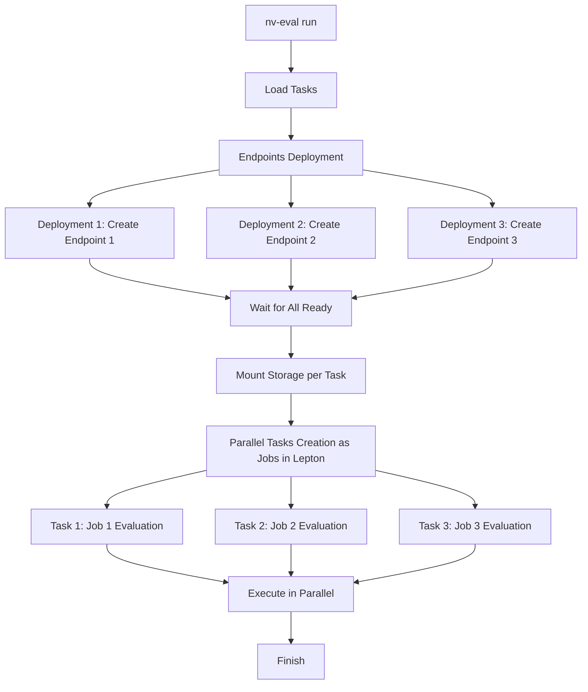

# Lepton Executor

The Lepton executor deploys endpoints and runs evaluations on Lepton AI. It's designed for fast, isolated, parallel evaluations using hosted or deployed endpoints.

See common concepts and commands in the executors overview.

## Prerequisites
- Lepton account and credentials configured
- Appropriate container images and permissions (for deployment flows)

## Install Lepton AI SDK
Install the Lepton AI SDK locally so you can connect to your workspace and submit jobs:
```bash
git clone https://github.com/leptonai/leptonai.git
cd leptonai
pip install .
```

## Authenticate with Your Lepton Workspace
Generate an API token and log in from the same Python environment where you installed `leptonai`:
1. Open your Lepton AI dashboard.
2. Go to Settings → Tokens.
3. Create a new token (use a descriptive name and long expiration).
4. Copy and securely save the token. It starts with "nvapi-".
5. Log in from your terminal:
```bash
lep login -c <workspace_name>:<your_token>
```

## Quick Start
Run a Lepton evaluation using the provided examples:
```bash
# Deploy NIM model and run evaluation
nv-eval run --config-dir examples --config-name lepton_nim_llama_3_1_8b_instruct

# Deploy vLLM model and run evaluation
nv-eval run --config-dir examples --config-name lepton_vllm_llama_3_1_8b_instruct

# Use an existing endpoint (no deployment)
nv-eval run --config-dir examples --config-name lepton_none_llama_3_1_8b_instruct
```

## Parallel Deployment Strategy
- Dedicated endpoints: Each task gets its own endpoint of the same model
- Parallel deployment: All endpoints are created simultaneously (~3x faster)
- Resource isolation: Independent tasks avoid mutual interference
- Storage isolation: Per-invocation directory `/shared/nemo-evaluator-launcher-workspace/{invocation_id}`
- Simple cleanup: Single command tears down endpoints and storage

Mermaid overview:


## Example Configuration
```yaml
evaluation:
  tasks:
    - name: gpqa_diamond
    - name: hellaswag
    - name: winogrande
```

## Configuration Notes
- Supports Hydra overrides for endpoint URLs, API keys, and execution output paths
- Environment variables can be passed to deployment containers via `deployment.envs`

## Troubleshooting
- Ensure Lepton credentials are valid and images are accessible
- Check that endpoints reach Ready state before jobs start
- Use launcher status commands to inspect job progress
