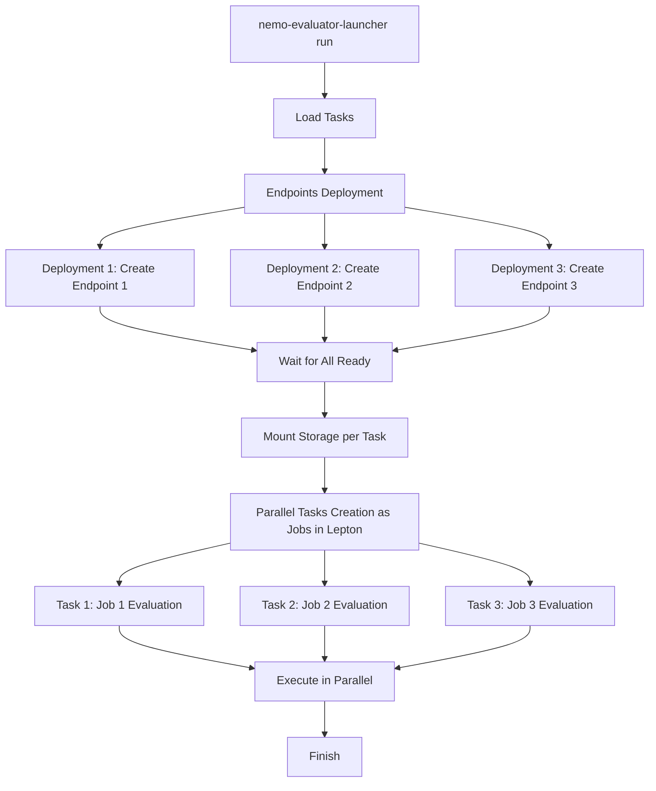

# Lepton Executor

The Lepton executor deploys endpoints and runs evaluations on Lepton AI. It enables fast, isolated, parallel evaluations using hosted or deployed endpoints. Refer to [DGX Cloud Lepton](https://www.nvidia.com/en-us/data-center/dgx-cloud-lepton/) for product details.

Refer to the [Executors Overview](index.md) for common concepts and commands.

## Prerequisites

Before you begin, ensure that you have:

- Lepton account and configured credentials
- Appropriate container images and permissions for deployment flows

## Authenticate with Your Lepton Workspace

Use an API token to sign in:

1. Open the Lepton AI dashboard.
2. Select **Settings** > **Tokens**.
3. Create a new token.
4. Copy and securely store the token. The value begins with "nvapi-".
5. From your terminal, sign in:

```bash
lep login -c <workspace_id>:<your_token>
```

> Note: Use the workspace ID, not the workspace name.

## Quick Start

Run a Lepton evaluation by using the provided examples:

```bash
# Deploy NIM model and run evaluation
nemo-evaluator-launcher run --config-dir examples --config-name lepton_nim_llama_3_1_8b_instruct

# Deploy vLLM model and run evaluation
nemo-evaluator-launcher run --config-dir examples --config-name lepton_vllm_llama_3_1_8b_instruct

# Use an existing endpoint (no deployment)
nemo-evaluator-launcher run --config-dir examples --config-name lepton_none_llama_3_1_8b_instruct
```

You might need to create registry keys in Lepton.

## Parallel Deployment Strategy

- Dedicated endpoints: Each task uses its own endpoint for the same model
- Parallel deployment: Create all endpoints simultaneously (about three times faster)
- Resource isolation: Independent tasks avoid interference
- Storage isolation: Per-invocation directory `/shared/nemo-evaluator-launcher-workspace/{invocation_id}`
- Simple cleanup: One command tears down endpoints and storage

Workflow overview:



## Example Configuration

```yaml
evaluation:
  tasks:
    - name: gpqa_diamond
    - name: hellaswag
    - name: winogrande
```

## Configuration Notes

- Hydra overrides are available for endpoint URLs, API keys, and execution output paths
- Pass environment variables to deployment containers by using `deployment.envs`

## Troubleshooting

- Verify that Lepton credentials are valid and images are accessible
- Confirm that endpoints reach the Ready state before jobs start
- Use launcher status commands to inspect job progress
