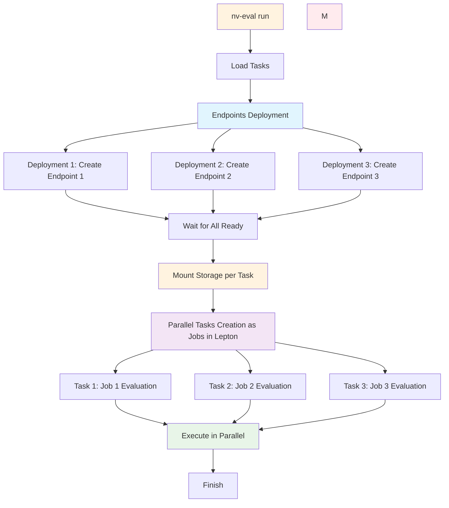

# NeMo-Evaluator-Launcher

A comprehensive evaluation platform for large language models (LLMs) that supports multiple benchmarks and execution environments.

> **Submit bugs**: please help us improve by submitting bugs and improvements http://nv/eval.issue!

> Below applies to version `0.3.0+`

## Installation

Install both `internal` and public the package using pip:

```bash
pip install nemo-evaluator-launcher --index-url https://gitlab-master.nvidia.com/api/v4/projects/155749/packages/pypi/simple
```

### Optional Exporters

To use the result exporters, install the optional dependencies separately:

```bash
# Install with MLflow exporter
pip install nemo-evaluator-launcher-internal[mlflow] --index-url https://gitlab-master.nvidia.com/api/v4/projects/155749/packages/pypi/simple

# Install with Weights & Biases exporter
pip install nemo-evaluator-launcher-internal[wandb] --index-url https://gitlab-master.nvidia.com/api/v4/projects/155749/packages/pypi/simple

# Install with Google Sheets exporter
pip install nemo-evaluator-launcher-internal[gsheets] --index-url https://gitlab-master.nvidia.com/api/v4/projects/155749/packages/pypi/simple

# Install with multiple exporters
pip install nemo-evaluator-launcher-internal[mlflow,wandb,gsheets] --index-url https://gitlab-master.nvidia.com/api/v4/projects/155749/packages/pypi/simple
```

**Supported Exporters:**
- **MLflow**: Track experiments and metrics in MLflow
- **Weights & Biases**: Log results to W&B for experiment tracking
- **Google Sheets**: Export results to Google Sheets for analysis

### Lepton AI Execution

For Lepton AI execution, install leptonai and configure credentials:

```bash
pip install leptonai
lep login login -c <workspace_id>:<token>
```

## Quick Start

### 1. List Available Benchmarks

View all available evaluation benchmarks:

```bash
nv-eval ls
```

**TODO(public release)**: change reference to the `nemo-evaluator`: readme

### 2. Run Evaluations

NV-Eval uses Hydra for configuration management. You can run evaluations using predefined configurations or create your own.

#### Using Example Configurations

The [examples/](examples/) directory contains ready-to-use configurations:

- **Local execution**: [local_llama_3_1_8b_instruct.yaml](examples/local_llama_3_1_8b_instruct.yaml)
- **Slurm cluster execution**: [slurm_llama_3_1_8b_instruct.yaml](examples/slurm_llama_3_1_8b_instruct.yaml)
- **Lepton AI execution**: [lepton_nim_llama_3_1_8b_instruct.yaml](examples/lepton_nim_llama_3_1_8b_instruct.yaml), [lepton_vllm_llama_3_1_8b_instruct.yaml](examples/lepton_vllm_llama_3_1_8b_instruct.yaml), [lepton_none_llama_3_1_8b_instruct.yaml](examples/lepton_none_llama_3_1_8b_instruct.yaml)

Run a local evaluation (requires docker):
```bash
nv-eval run --config-dir examples --config-name local_llama_3_1_8b_instruct --override execution.output_dir=<YOUR_OUTPUT_LOCAL_DIR>
```

Run a Slurm cluster evaluation:
```bash
nv-eval run --config-dir examples --config-name slurm_llama_3_1_8b_instruct --override execution.output_dir=<YOUR_OUTPUT_DIR_ON_CLUSTER>
```

Run a Lepton AI evaluation (requires leptonai and Lepton credentials):
```bash
# Deploy NIM model and run evaluation
nv-eval run --config-dir examples --config-name lepton_nim_llama_3_1_8b_instruct

# Deploy vLLM model and run evaluation
nv-eval run --config-dir examples --config-name lepton_vllm_llama_3_1_8b_instruct

# Use existing endpoint for evaluation
nv-eval run --config-dir examples --config-name lepton_none_llama_3_1_8b_instruct
```

#### Lepton Execution Strategy

The Lepton executor provides **parallel endpoint deployment** for optimal resource isolation and performance:

- **Dedicated Endpoints**: Each evaluation task gets its own endpoint of the same model
- **Parallel Deployment**: All endpoints created simultaneously (~3x faster than sequential)
- **Resource Isolation**: Tasks run independently without interference
- **Storage Isolation**: Each evaluation gets isolated directory `/shared/nv-eval-workspace/{invocation_id}`
- **Simple Cleanup**: Single command removes all endpoints and storage

**Architecture Diagram:**



**Example Configuration:**
```yaml
evaluation:
  tasks:
    - name: gpqa_diamond    # Gets endpoint: nim-gpqa-d-0-abc123
    - name: hellaswag       # Gets endpoint: nim-hellas-1-abc123
    - name: winogrande      # Gets endpoint: nim-winogr-2-abc123
```

Generate all the configs:
```bash
python scripts/generate_configs.py
```

#### Creating Custom Configurations

1. Create your own configuration directory:
```bash
mkdir my_configs
```

2. Copy an example configuration as a starting point:
```bash
cp examples/local_llama_3_1_8b_instruct.yaml my_configs/my_evaluation.yaml
```

3. Modify the configuration to suit your needs:
   - Change the model endpoint
   - Adjust evaluation parameters
   - Select different benchmarks
   - Configure execution settings

4. Run your custom configuration:
```bash
nv-eval run --config-dir my_configs --config-name my_evaluation
```

#### Configuration Overrides

You can override configuration values from the command line (`-o` can be used multiple times, the notation is following hydra)

```bash
nv-eval run --config-dir examples --config-name local_llama_3_1_8b_instruct \
  -o execution.output_dir=my_results \
  -o target.api_endpoint.model_id=model/another/one
```

#### Environment Variables in Deployment

The platform supports passing environment variables to deployment containers in a Hydra-extensible way:

**Direct Values:**
```yaml
deployment:
  type: vllm
  envs:
    CUDA_VISIBLE_DEVICES: "0,1,2,3,4,5,6,7"
    OMP_NUM_THREADS: "1"
    VLLM_USE_FLASH_ATTN: "1"
```

**Environment Variable References:**
```yaml
deployment:
  type: sglang
  envs:
    HF_TOKEN: ${oc.env:HF_TOKEN}  # References host environment variable
    NGC_API_KEY: ${oc.env:NGC_API_KEY}
```

**Supported Executors:**
- **SLURM**: Environment variables are exported in the sbatch script before running deployment commands
- **Lepton**: Environment variables are passed to the container specification
- **Local**: Environment variables are passed to Docker containers (when deployment support is added)

**Example with SLURM:**
```yaml
deployment:
  type: vllm
  envs:
    CUDA_VISIBLE_DEVICES: "0,1,2,3,4,5,6,7"
    HF_TOKEN: ${oc.env:HF_TOKEN}
    VLLM_USE_V2_BLOCK_MANAGER: "1"
  command: vllm serve /checkpoint --port 8000
```

This will generate a sbatch script that exports these variables before running the deployment command.

### 3. Check Evaluation Status

Monitor the status of your evaluation jobs:

```bash
nv-eval status <job_id_or_invocation_id>
```

You can check:
- **Individual job status**: `nv-eval status <job_id>`
- **All jobs in an invocation**: `nv-eval status <invocation_id>`

The status command returns JSON output with job status information.


## Using python API

Consider checking out [Python notebooks](./examples/notebooks)

## Troubleshooting

### View Full Configuration

To see the complete resolved configuration:

```bash
nv-eval run --config-dir examples --config-name local_llama_3_1_8b_instruct --dry-run
```

## Contributing

See [CONTRIBUTING.md](CONTRIBUTING.md) for guidelines on contributing to the project.
