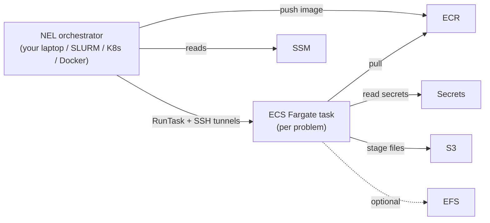
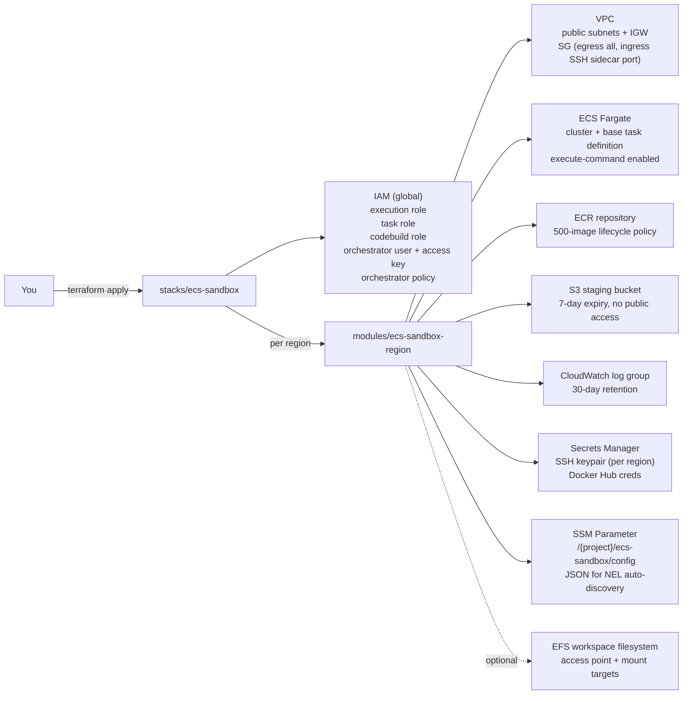

# Reference Terraform — AWS ECS Fargate Sandbox Executor

This directory contains a **reference implementation** of the AWS infrastructure that NEL's `ECSFargateSandbox` backend targets — i.e. the per-problem sandbox executor where each agent / code-execution task is run as an ECS Fargate task. **NEL itself is not deployed here**; the orchestrator (eval loop) keeps running wherever you launch `nel eval run` (local machine, SLURM login node, Docker, K8s pod, etc.) and submits per-task `RunTask` calls to this cluster.

It is intended as a minimum working example: external users can `terraform apply` it in their own AWS account and end up with the same topology that NEL's [`ECSFargateSandbox`](../docs/architecture/sandbox.md#ecsfargatesandbox) expects.

> [!IMPORTANT]
> Running this stack creates real AWS resources (VPC, ECS cluster, ECR repo, S3 bucket, EFS, Secrets Manager, IAM users/roles). You are responsible for the costs and the lifecycle. Use `terraform destroy` to tear everything down.

## How NEL talks to it



The orchestrator process never leaves its host — only the per-problem sandbox runs in ECS, one Fargate task per benchmark problem. Multiplexing, lifecycle, and SSH tunnels are handled by [`ECSFargateSandbox`](../src/nemo_evaluator/sandbox/ecs_fargate.py).

## What this Terraform provisions



Every regional resource is created behind a per-region AWS provider alias, so you can provision one region or eleven from the same root config without changing anything but `var.regions`.

## Layout

```
terraform/
├── modules/
│   └── ecs-sandbox-region/      # Regional building block (1 instance per region)
│       ├── ecs.tf               # ECS cluster + base task definition
│       ├── network.tf           # VPC, subnets, IGW, security group
│       ├── storage.tf           # ECR repo + lifecycle, S3 staging, log group
│       ├── secrets.tf           # SSH keys + Docker Hub credentials
│       ├── ssm.tf               # NEL auto-discovery config parameter
│       ├── efs.tf               # Optional EFS workspace filesystem
│       ├── outputs.tf
│       ├── variables.tf
│       └── versions.tf
└── stacks/
    └── ecs-sandbox/             # Root stack you `terraform apply`
        ├── main.tf              # Per-region module instantiations + shared TLS key
        ├── iam.tf               # Global IAM (roles + orchestrator user/policy)
        ├── provider.tf          # Default provider + 11 regional aliases
        ├── outputs.tf
        ├── variables.tf
        ├── versions.tf
        ├── backend.tf.example   # Optional remote state (commented)
        ├── terraform.tfvars.example
        └── README.md
```

## Prerequisites

- [Terraform](https://developer.hashicorp.com/terraform/install) **>= 1.5**
- AWS credentials with permissions for VPC, ECS, ECR, S3, EFS, IAM, Secrets Manager, SSM, and CloudWatch Logs in every region you plan to provision. The bootstrap operator effectively needs `AdministratorAccess` or an equivalent custom policy.
- AWS account quotas: each region consumes 1 VPC + 2 subnets + 1 ECR repo + 1 S3 bucket + 1 EFS (if enabled). Default account limits are usually sufficient.

## Quick start

1. Pick the regions you want to provision and copy the example tfvars:

   ```sh
   cd terraform/stacks/ecs-sandbox
   cp terraform.tfvars.example terraform.tfvars
   $EDITOR terraform.tfvars   # set project, regions, tags
   ```

2. Initialize and review the plan:

   ```sh
   terraform init
   terraform plan -out tfplan
   ```

3. Apply:

   ```sh
   terraform apply tfplan
   ```

4. Inspect outputs (the orchestrator's secret access key is sensitive):

   ```sh
   terraform output
   terraform output -raw orchestrator_secret_access_key
   ```

## Wiring NEL to the provisioned cluster

After `terraform apply`, point your NEL config at the provisioned region(s):

```yaml
benchmarks:
  - name: harbor://swebench-verified@1.0
    solver:
      type: harbor
    sandbox:
      type: ecs_fargate
      region: us-west-2          # must be one of var.regions
      ssm_project: nel-sandbox   # must match var.project (default "harbor")
      # cluster, subnets, security_groups, role ARNs, ECR, S3, EFS, and
      # the SSH-sidecar key ARNs are read from
      #   /{ssm_project}/ecs-sandbox/config
      # in SSM. Anything you set explicitly in YAML still wins.
```

The auto-discovery trigger is precisely **`region` set + `cluster` unset** (see `_build_ecs_sandbox_config` in `src/nemo_evaluator/orchestration/orchestrator.py`). The default `ssm_project` in the schema is `"harbor"`; external users running this reference Terraform must override it to match `var.project` from their `terraform.tfvars`.

Set the orchestrator AWS credentials via your usual chain (env vars, profile, IRSA, etc.); see the `orchestrator_access_key_id` / `orchestrator_secret_access_key` outputs.

## Configuration knobs (root stack)

| Variable | Default | Notes |
|----------|---------|-------|
| `project` | `nel-sandbox` | Resource name prefix; must be DNS-safe |
| `regions` | 11 regions | Set to `["us-west-2"]` for an MWE |
| `vpc_base_cidr` | `10.0.0.0/8` | Per-region `/16` carved out via `cidrsubnet` |
| `subnet_count` | `2` | Public subnets per region |
| `ssh_tunnel_sshd_port` | `2222` | Sidecar listening port |
| `ecs_task_cpu` | `4096` | Fargate CPU units |
| `ecs_task_memory` | `16384` | Fargate memory (MiB) |
| `enable_efs` | `true` | Per-region EFS workspace filesystem |
| `dockerhub_username` / `dockerhub_token` | `""` | Optional, avoids anonymous pull rate limits |
| `tags` | `{Project, ManagedBy}` | Merged into every resource |

See [`stacks/ecs-sandbox/variables.tf`](stacks/ecs-sandbox/variables.tf) for the authoritative list and [`stacks/ecs-sandbox/README.md`](stacks/ecs-sandbox/README.md) for the per-stack walkthrough.

## State backend

Out of the box this stack uses **local state** — `terraform.tfstate` lives next to the stack files and is gitignored. That is fine for a single operator running an MWE.

For shared state (CI runners, multiple operators), copy [`stacks/ecs-sandbox/backend.tf.example`](stacks/ecs-sandbox/backend.tf.example) to `backend.tf`, fill in your S3 bucket and DynamoDB lock table, and run `terraform init -reconfigure`. You must create the bucket and table yourself; this repo intentionally does not bootstrap them.

## Outputs you'll likely consume

| Output | Description |
|--------|-------------|
| `orchestrator_access_key_id` / `orchestrator_secret_access_key` | Credentials for the IAM user that runs NEL. Pipe to `aws configure` or your CI vault. |
| `ssm_config_parameter_names` | Map `region -> /{project}/ecs-sandbox/config`. NEL auto-discovers everything by reading this. |
| `vpc_ids` | Map `region -> vpc_id` for diagnostics. |
| `execution_role_arn` / `task_role_arn` / `codebuild_service_role_arn` | Use when submitting tasks/builds outside NEL. |

## Security notes

- The ECS-task security group's ingress is open to `0.0.0.0/0` on `ssh_tunnel_sshd_port`. **Tighten this to your orchestrator's egress IP** before using the sandbox for anything beyond a demo (see [`modules/ecs-sandbox-region/network.tf`](modules/ecs-sandbox-region/network.tf)).
- The orchestrator user's access key is stored in Terraform state. Treat the state file as a secret, or move to a remote backend with encryption + access control before sharing.
- The S3 staging bucket has Public Access Block enabled and a 7-day object expiry; do not put long-term data there.
- Terraform files are scanned by SonarQube's bundled IaC analyzer in CI ([`sonar-project.properties`](../sonar-project.properties)). New rule findings will surface on every MR.

## Tearing it down

```sh
cd terraform/stacks/ecs-sandbox
terraform destroy
```

`force_destroy = true` is set on ECR and S3 so they delete even when non-empty. Secrets Manager entries use `recovery_window_in_days = 0` so they delete immediately.

## What is intentionally not included

- **NEL itself.** This stack only provisions the per-task sandbox executor. The orchestrator process runs wherever you choose; see the [Deployment Guide](../docs/deployment/index.md) for those options.
- **State bucket bootstrap.** Bring your own S3 + DynamoDB if you want a remote backend.
- **GitLab runners or other CI fleets.** Out of scope for this reference.
- **Live apply in CI.** Applying happens from your machine. The repo's CI only runs static analysis (`terraform fmt`/`validate` and Sonar's IaC scanner).
